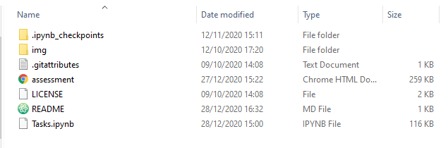
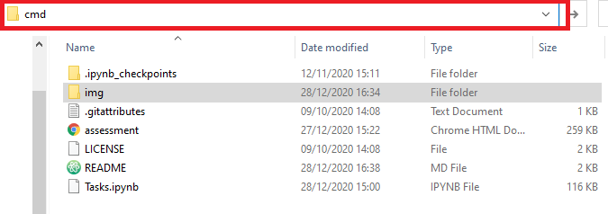
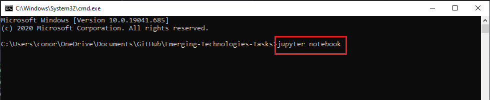
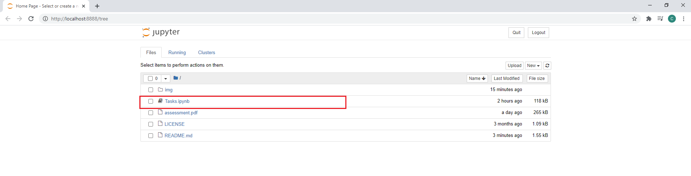
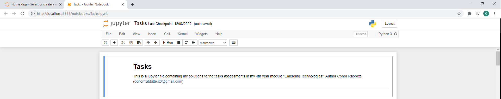
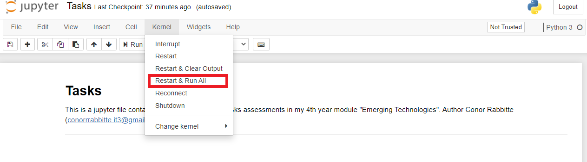
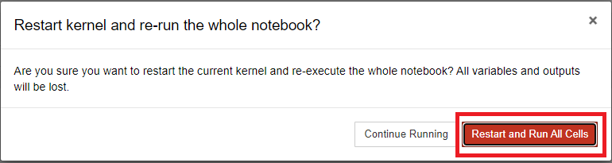

# Emerging-Technologies-Tasks

**Version 1.0.0**

A README for a 4th Year assignment in the module Emerging Technologies. This assignment consists of 4 tasks to be researched, summarized, and coded in python using Jupyter Notebook.

## Setup and Requirements

In order to use this git-repo you will need to have installed on your computer [Python 3](https://www.python.org/downloads/) and [Jupyter](https://jupyter.org/install). You can follow the links to download and install them separately, or you can download both in one step by installing [Anaconda](https://www.anaconda.com/products/individual).

Anaconda will be a large download of approx. 450Mbs in size and will contain both Python 3 and Jupyter in its installation. Once downloaded run the install wizard and upon finishing you will be able to run the program found in this git-repo.

## Folder Structure

- **.ipynb_checkpoints** : Stores jupyter notebook checkpoints (auto save files) for recovery and loading.
- **img** : Stores all images found in this project repository.
- **.gitattributes** : Contains git ignore and attribute configurations.
- **assessment** : Pdf file of the modules task assessments.
- **LICENSE** : Standard MIT LICENSE.
- **README** : Markdown file acts as README for git repository.
- **Tasks.ipynb** : Jupyter Notebook file containing the projects work in Markdown and Python.

## Running the Program

Clone the git-repo to your computer and you should have the following folder structure.

Next open up a command prompt in this folder. The easiest way to do this is to click on the folder path and type 'cmd' and hit the enter key, as seen below

Following this the command terminal will open in the repos folder path. Then type into the command terminal 'jupyter notebook' and hit the enter key.

This will open up the Jupyter Notebook program in your default browser. Click on the item 'Tasks.ipynb' as seen below.

This will open a new tab in your browser with the Tasks assignment running in Jupyter Notebook.

Now click on the tab 'Kernel' and in the dropdown menu select the 'Restart & Run All' option. This will restart the program and run each line sequentially.

You are now ready to use the Tasks program. You can read through and even edit, if you wish, the Markdown and/or Python cells.

## License & Copyright

© Conor Rabbitte, Galway-Mayo Institute Technology Software Development
